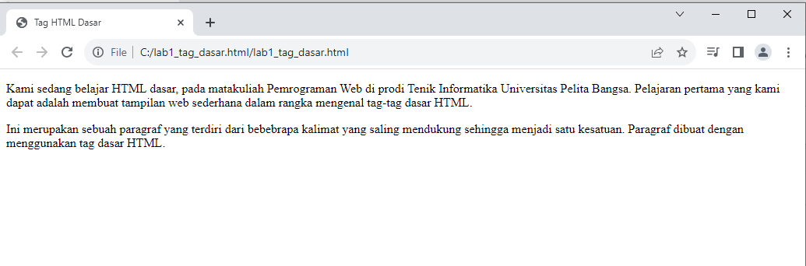
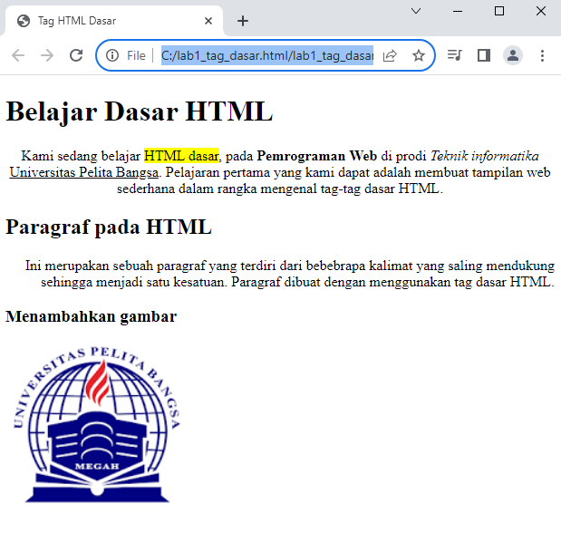
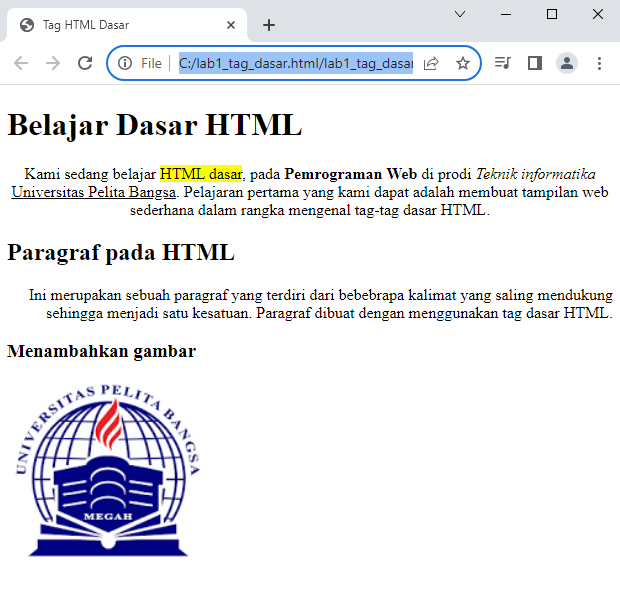
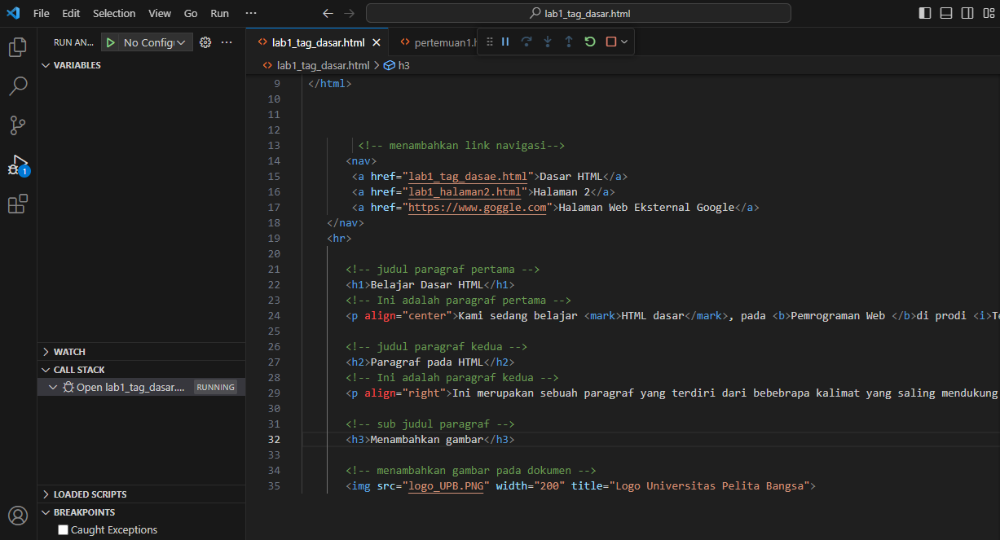
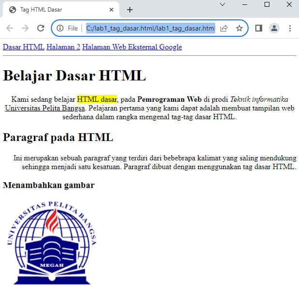

# PEMROGRAMAN WEB 1

# Langkah Langkah praktikum

- Pertama taman membuat file dasar terlebih dahulu dengan menggunakan html yang ada pada vscode 

- Kemudian coba untuk membuka file pada browser yang di inginkan saya disini menggunakan chrome 

- Kemudian saya membuat paragraf sederhana yang di minta seperti gambar di bawah ini

- Kemudian saya mencoba untuk melihat hasil yang saya buat dalam menulis paragraf tersebut dengan gambar di bawah ini 

- Kemudian saya mencoba untuk merubah beberapa atribut dengan menggunakan beberapa perbedaan dan juga saya menambahkan judul pada paragraf tersebut

- Setelah itu saya mencoba untuk membuka browser untuk melihat hasil nya dari yang di minta untuk merubah beberapa tulisan dan menambah judul

- Kemudian saya mencoba untuk memformat teks seperti yang fi minta saya mengubah warna menebalkan tulisan dan menambah garis bawah pada tulisan

- Dan hasil yang dibuat saya tampulkan seperti ini sesuai yang di minta yaitu mengubah warna menebalkan tulisan dan menambah garis bawah pada tulisan

- Menyisipkan atau menambahkan gambar yang di inginkan pada halaman web kita yang telah di buat dengan menggunakan perintah seperti di bawah ini 

- Hasil dari menyisipkan gambar yang telah saya lakukan tadi pada halaman web yang telah kita buat tadi hasil nya seperti ini

- Kemudian menyesuaikan tambar dengan ukuran aslinya dengan cara mengatur width dan height sesuai dengan yang kita inginkan

- Hasil dari mengubah width dengan menggunakan 200 hasil nya seperti ini

- Yang terakhir kita menambah kan hyperlink pada dokumen dengan menggunakan perintah seperti di bawah ini agar lebih memudahkan 

- Hasil dari menambahkan hyperlink pada halaman web kita kemudian muncul di sebelah kiri atas sesuai dengan perintah kita 

# Pertanyaan 

1. Lakukan perubahan pada kode sesuai dengan keinginan anda, amati perubahannya adakah
error ketika terjadi kesalahan penulisan tag?

2. Apa perbedaan dari tag 
 dengan tag  , berikan penjelasannya!

3. Apa perbedaan atribut title dan alt pada tag , berikan penjelasannya!

4. Untuk mengatur ukuran gambar, digunakan atribut width dan height. Agar tampilan gambar
proporsional sebaiknya kedua atribut tersebut diisi semua atau tidak? Berikan penjelasannya
!

5. Pada link tambahkan atribut target dengan nilai atribut bervariasi ( _blank, _self, _top,
_parent ), apa yang terjadi pada masing-masing nilai antribut tersebut

# Jawaban 

# 1 
- Perubahan pada kode sudah saya coba mungkin ada beberapa yang menjadi eror karna saya kurang menambahkan beberapa kata sehingga hasil nya menjadi eror tapi setelah saya lakukan beberapa kali tidak ada eror atau kesalahan lagi

# 2 
- Tag  
 di gunakan untuk kita dalam membuat paragraf teks atau untuk blok teks 
- setiap kali kita menggunakan tag akan di mulai dengan garis baru memiliki garis atas dan bawah
- dan juga secara otomatis memberikan margin atau jarak

- Tag  digunakan untuk membuat pemisah baru dalam teks

- ketika anda ingin menambah jarak antara dua elemen teks 
- menambah spasi atas dan juga bawah secara default 

# 3
- Atribut alt (Alternate Text):
Atribut alt digunakan untuk memberikan teks alternatif untuk gambar. Ini adalah teks yang akan ditampilkan jika gambar tidak dapat dimuat, jika pengguna menggunakan perangkat pembaca layar, atau jika pengguna mematikan gambar dalam peramban mereka.

- Atribut title digunakan untuk memberikan judul atau informasi tambahan tentang gambar saat pengguna mengarahkan kursor mouse ke gambar tersebut. Ini akan menampilkan tooltip yang berisi teks yang diberikan dalam atribut title.

# 4 
- Ketika Anda mengisi kedua atribut width dan height dengan nilai yang sesuai, gambar akan ditampilkan dengan ukuran yang tepat, dan proporsinya akan terjaga. Ini sangat disarankan, terutama jika Anda ingin menjaga tampilan gambar tetap proporsional dan menghindari distorsi.

- Sebaiknya, dalam kebanyakan kasus, sangat disarankan untuk mengisi kedua atribut width dan height untuk mengontrol ukuran gambar dengan tepat dan menjaga proporsionalitasnya. Namun, jika Anda hanya ingin mengontrol satu dimensi dan membiarkan dimensi lainnya disesuaikan otomatis, Anda dapat mengisi salah satu atribut dan biarkan yang lainnya kosong atau tidak diisi

# 5
- Ketika Anda menggunakan target="_blank", tautan akan dibuka di jendela atau tab baru dalam peramban web.

- target="_self" adalah nilai default dari atribut target. Ketika tautan memiliki target="_self", tautan akan dibuka di jendela atau tab yang sama di mana tautan tersebut berada.

- Ketika Anda menggunakan target="_top", tautan akan membuka halaman baru di jendela atau tab yang paling atas dalam hierarki jendela peramban.

- target="_parent" digunakan ketika Anda memiliki bingkai (frames) dalam halaman web Anda. Tautan ini akan membuka halaman baru di bingkai atau jendela "induk" dari bingkai tempat tautan tersebut berada.
